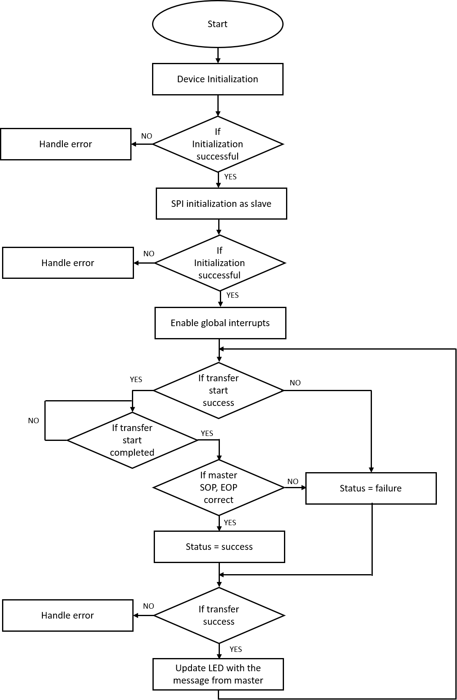
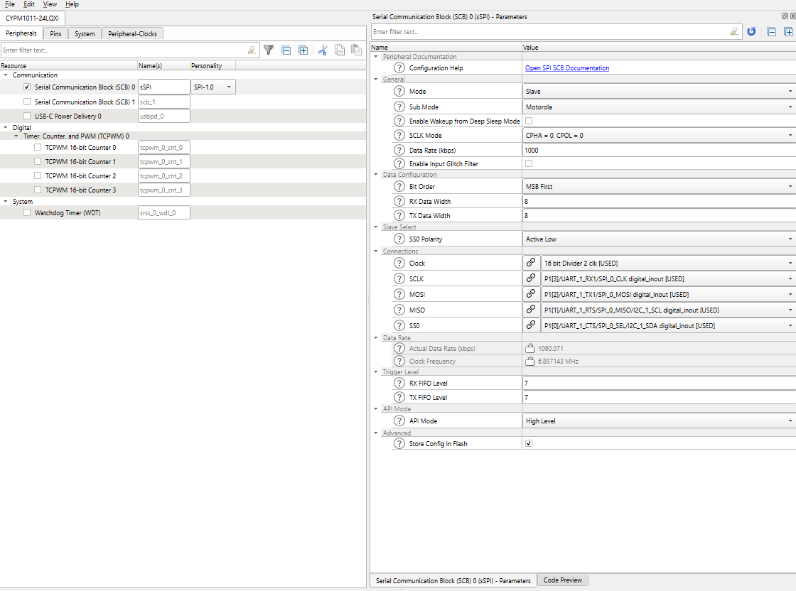

# EZ-PD&trade; PMG1 MCU: SPI slave

This example demonstrates the use of a SPI resource of the PMG1 MCU in slave mode. The SPI slave is configured to receive command packets from an SPI master. The slave's LED is activated depending on the command packet received from the master.

[View this README on GitHub.](https://github.com/Infineon/mtb-example-pmg1-spi-slave)

[Provide feedback on this code example.](https://cypress.co1.qualtrics.com/jfe/form/SV_1NTns53sK2yiljn?Q_EED=eyJVbmlxdWUgRG9jIElkIjoiQ0UyMzE4NTUiLCJTcGVjIE51bWJlciI6IjAwMi0zMTg1NSIsIkRvYyBUaXRsZSI6IkVaLVBEJnRyYWRlOyBQTUcxIE1DVTogSGVsbG8gd29ybGQiLCJyaWQiOiJ2bmFsIiwiRG9jIHZlcnNpb24iOiIyLjAuMCIsIkRvYyBMYW5ndWFnZSI6IkVuZ2xpc2giLCJEb2MgRGl2aXNpb24iOiJNQ0QiLCJEb2MgQlUiOiJXSVJFRCIsIkRvYyBGYW1pbHkiOiJUWVBFLUMgVVNCIn0=)

## Requirements

- [ModusToolbox&trade; software](https://www.cypress.com/products/modustoolbox-software-environment) v2.3 or later (tested with v2.3)
- Set the CY_SUPPORTED_KITS environment variable with the value of "PMG1" to enable support for the PMG1 parts and BSPs under ModusToolbox&trade; software
- Board support package (BSP) minimum required version: 1.2.0
- Programming language: C
- Associated parts: All [EZ-PD&trade; PMG1 MCU](https://www.cypress.com/PMG1) parts

## Supported toolchains (make variable 'TOOLCHAIN')

- GNU Arm® Embedded Compiler v9.3.1 (`GCC_ARM`) - Default value of `TOOLCHAIN`
- Arm&reg; Compiler v6.13 (`ARM`)
- IAR C/C++ Compiler v8.42.2 (`IAR`)

## Supported kits (make variable 'TARGET')

- [EZ-PD&trade; PMG1-S0 prototyping kit](http://www.cypress.com/CY7110) (`PMG1-CY7110`) - Default value of `TARGET`
- [EZ-PD&trade; PMG1-S1 prototyping kit](http://www.cypress.com/CY7111) (`PMG1-CY7111`)
- [EZ-PD&trade; PMG1-S2 prototyping kit](http://www.cypress.com/CY7112) (`PMG1-CY7112`)
- [EZ-PD&trade; PMG1-S3 prototyping kit](http://www.cypress.com/CY7113) (`PMG1-CY7113`)

## Hardware setup

This example uses the board's default configuration. See the kit user guide to ensure that the board is configured correctly.

A kit listed in [Supported Kits](#supported-kits-make-variable-target) runs this slave example. A second kit and the code example, [CE233902 - PMG1 SPI Master](https://github.com/Infineon/mtb-example-pmg1-spi-master) are recommended for testing this code example.

Use jumper wires to establish a connection between the master and the slave. The pin assignments for the master and slave devices for the different supported kits are listed in Table 1.

**Table 1. Pin connections SPI Slave to SPI Master kit**


| Development kit |     MOSI      |     MISO      |     SCLK      |     CS        | Ground |
| :-------------- | :------------ | :------------ | :------------ | :------------ | :----- |
| PMG1-S0         | P1[2] / J6.10 | P1[1] / J7.12 | P1[3] / J6.9  | P1[0] / J7.11 |  GND / J6.14  |
| PMG1-S1         | P5[0] / J7.7  | P5[1] / J7.6  | P3[0] / J7.11 | P2[2] / J7.15 |  GND / J6.17  |
| PMG1-S2         | P3[4] / J6.13 | P1[0] / J6.10 | P3[5] / J6.14 | P1[1] / J6.9  |  GND / J6.17  |
| PMG1-S3         | P3[0] / J6.12 | P3[6] / J6.10 | P3[5] / J6.9  | P3[3] / J6.11 |  GND / J6.18  |


**Table 2. Signal connections between master and slave kits**
Master  | Slave
--------|------
MOSI    | MOSI
MISO    | MISO
SCLK    | SCLK
CS      | CS
GND     | GND

## Software setup

This example requires no additional software or tools.

## Using the code example

Create the project and open it using one of the following:

<details><summary><b>In Eclipse IDE for ModusToolbox&trade; software</b></summary>

1. Click the **New Application** link in the **Quick Panel** (or, use **File** > **New** > **ModusToolbox Application**). This launches the [Project Creator](https://www.cypress.com/ModusToolboxProjectCreator) tool.

2. Pick a kit supported by the code example from the list shown in the **Project Creator - Choose Board Support Package (BSP)** dialog.

   When you select a supported kit, the example is reconfigured automatically to work with the kit. To work with a different supported kit later, use the [Library Manager](https://www.cypress.com/ModusToolboxLibraryManager) to choose the BSP for the supported kit. You can use the Library Manager to select or update the BSP and firmware libraries used in this application. To access the Library Manager, click the link from the **Quick Panel**.

   You can also just start the application creation process again and select a different kit.

   If you want to use the application for a kit not listed here, you may need to update the source files. If the kit does not have the required resources, the application may not work.

3. In the **Project Creator - Select Application** dialog, choose the example by enabling the checkbox.

4. (Optional) Change the suggested **New Application Name**.

5. The **Application(s) Root Path** defaults to the Eclipse workspace which is usually the desired location for the application. If you want to store the application in a different location, you can change the *Application(s) Root Path* value. Applications that share libraries should be in the same root path.

6. Click **Create** to complete the application creation process.

For more details, see the [Eclipse IDE for ModusToolbox&trade; software user guide](https://www.cypress.com/MTBEclipseIDEUserGuide) (locally available at *{ModusToolbox&trade; software install directory}/ide_{version}/docs/mt_ide_user_guide.pdf*).

</details>

<details><summary><b>In command-line interface (CLI)</b></summary>

ModusToolbox&trade; software provides the Project Creator as both a GUI tool and the command line tool, "project-creator-cli". The CLI tool can be used to create applications from a CLI terminal or from within batch files or shell scripts. This tool is available in the *{ModusToolbox&trade; software install directory}/tools_{version}/project-creator/* directory.

Use a CLI terminal to invoke the "project-creator-cli" tool. On Windows, use the command line "modus-shell" program provided in the ModusToolbox&trade; software installation instead of a standard Windows command-line application. This shell provides access to all ModusToolbox&trade; software tools. You can access it by typing `modus-shell` in the search box in the Windows menu. In Linux and macOS, you can use any terminal application.

This tool has the following arguments:

Argument | Description | Required/optional
---------|-------------|-----------
`--board-id` | Defined in the `<id>` field of the [BSP](https://github.com/Infineon?q=bsp-manifest&type=&language=&sort=) manifest | Required
`--app-id`   | Defined in the `<id>` field of the [CE](https://github.com/Infineon?q=ce-manifest&type=&language=&sort=) manifest | Required
`--target-dir`| Specify the directory in which the application is to be created if you prefer not to use the default current working directory | Optional
`--user-app-name`| Specify the name of the application if you prefer to have a name other than the example's default name | Optional

<br>

The following example will clone the "[Hello World](https://github.com/infineon/mtb-example-pmg1-hello-world)" application with the desired name "MyHelloWorld" configured for the *PMG1-CY7110* BSP into the specified working directory, *C:/mtb_projects*:

   ```
   project-creator-cli --board-id PMG1-CY7110 --app-id mtb-example-pmg1-hello-world --user-app-name MyHelloWorld --target-dir "C:/mtb_projects"
   ```

**Note:** The project-creator-cli tool uses the `git clone` and `make getlibs` commands to fetch the repository and import the required libraries. For details, see the "Project creator tools" section of the [ModusToolbox&trade; software user guide](https://www.cypress.com/ModusToolboxUserGuide) (locally available at *{ModusToolbox&trade; software install directory}/docs_{version}/mtb_user_guide.pdf*).

</details>

<details><summary><b>In third-party IDEs</b></summary>

Use one of the following options:

- **Use the standalone [Project Creator](https://www.cypress.com/ModusToolboxProjectCreator) tool:**

   1. Launch Project Creator from the Windows Start menu or from *{ModusToolbox&trade; software install directory}/tools_{version}/project-creator/project-creator.exe*.

   2. In the initial **Choose Board Support Package** screen, select the BSP, and click **Next**.

   3. In the **Select Application** screen, select the appropriate IDE from the **Target IDE** drop-down menu.

   4. Click **Create** and follow the instructions printed in the bottom pane to import or open the exported project in the respective IDE.

<br>

- **Use command-line interface (CLI):**

   1. Follow the instructions from the **In command-line interface (CLI)** section to create the application, and then import the libraries using the `make getlibs` command.

   2. Export the application to a supported IDE using the `make <ide>` command.

   3. Follow the instructions displayed in the terminal to create or import the application as an IDE project.

For a list of supported IDEs and more details, see the "Exporting to IDEs" section of the [ModusToolbox&trade; software user guide](https://www.cypress.com/ModusToolboxUserGuide) (locally available at *{ModusToolbox&trade; software install directory}/docs_{version}/mtb_user_guide.pdf*).

</details>


## Operation

1. Ensure that the steps listed in the [Hardware setup](#hardware-setup) section are completed.

2. Ensure that the jumper shunt on power selection jumper (J5) is placed at position 2-3 to enable programming.

3. Connect the board to your PC using the USB cable through the KitProg3 USB Type-C port (J1).

4. Program the board using one of the following:

   <details><summary><b>Using Eclipse IDE for ModusToolbox&trade; software</b></summary>

      1. Select the application project in the Project Explorer.

      2. In the **Quick Panel**, scroll down, and click **\<Application Name> Program (KitProg3_MiniProg4)**.
   </details>

   <details><summary><b>Using CLI</b></summary>

     From the terminal, execute the `make program` command to build and program the application using the default toolchain to the default target. The default toolchain and target are specified in the application's Makefile but you can override those values manually:
      ```
      make program TARGET=<BSP> TOOLCHAIN=<toolchain>
      ```

      Example:
      ```
      make program TARGET=PMG1-CY7110 TOOLCHAIN=GCC_ARM
      ```
   </details>


5. After programming the kit, disconnect the USB cable and change the position on power selection jumper (J5) to 1-2 to power the kit through the PMG1 USB PD sink port (J10).

6. Connect and program the master kit - see code example [CE233902](https://github.com/Infineon/mtb-example-pmg1-spi-master) -PMG1 MCU: SPI master.

7. Power the slave kit first using a USB cable through the PMG1 USB PD sink port (J10). After this, power the master kit in the same way.

8. Confirm that the slave and the master kit's user LEDs blink at approximately 1 Hz.

## Debugging

You can debug the example to step through the code. In the IDE, use the **\<Application Name> Debug (KitProg3_MiniProg4)** configuration in the **Quick Panel**. Ensure that the board is connected to your PC using the USB cable through the KitProg3 USB Type-C port (J1) and the jumper shunt on power selection jumper (J5) is placed at position 1-2.

See the "Debug mode" section in the kit user guide for debugging the application on CY7110 prototyping kit. For more details, see the "Program and debug" section in the [Eclipse IDE for ModusToolbox&trade; software user guide](https://www.cypress.com/MTBEclipseIDEUserGuide).

## Design and implementation

The program follows the logic shown in the next flowchart:

**Figure 1. program flowchart**



To implement the SPI data transfer on the SCB hardware block, the SPI APIs are used. The SPI is initialized with the following settings:

SPI settings | Value
-------------|-------
Name | sSPI
Mode| Slave
Sub Mode | Motorola
SCLK Mode | CPHA = 0, CPOL = 0
Data rate | 1000
Oversample | 16
Bit order| MSB First
RX Data Width | 8
TX Data Width | 8
RX FIFO Level | 7
TX FIFO Level | 7

**Figure 2. SPI configuration**



### Packet format sent by the master to the slave

The master sends the command to control the status of the LED every 1 second. The command has a `StartOfPacket (SOP)` followed by the LED status and an `EndOfPacket (EOP)`. This command is decoded by the slave and sets the LED status only if the SOP and EOP and received correctly.

| SoP  | LED status | EoP  |
|------|------------|------|
| 0x01 | 0x00 or 0x01 | 0x17 |

### Packet format sent by the slave to the master

The slave sends the status packet as reply to the previous command. The command has a `StartOfPacket (SOP)` followed by the LED status and an `EndOfPacket (EOP)`. This command is decoded by the master and sets the LED status only if the SOP and EOP and received correctly.

| SoP  | LED status | EoP  |
|------|------------|------|
| 0x01 | 0x00 or 0x01 | 0x17 |

### Resources and settings

In this code example, the PMG1 SCB block is configured as a SPI master. The master sends a packet to the slave with a command to turn ON or turn OFF the user LED at an interval of 1 second. The packet consists of a start byte, a command byte, and an end byte. The start and end bytes are checked, and if the bytes are correct, the USER LED is controlled as per the command byte.

After this, the slave sends a status packet to the master with the current LED status. The master activates its LED depending on the status received. Therefore the master's LED blinks at the same rate as the slave's.

**Table 3. Application resources**

| Resource  |  Alias/object     |    Purpose     |
| :------- | :------------ | :------------ |
| SCB (SPI) (PDL) |mSPI_HW          | SPI slave driver to communicate with the SPI master |
| GPIO (PDL)    | CYBSP_USER_LED         | User LED                  |

## Related resources

Resources | Links
-----------|------------------
Application notes |[AN232553](https://www.cypress.com/an232553) – Getting started with EZ-PD&trade; PMG1 MCU on ModusToolbox&trade; software <br> [AN232565](https://www.cypress.com/an232565) – EZ-PD&trade; PMG1 hardware design guidelines and checklist
Code examples | [Using ModusToolbox&trade; software](https://github.com/Infineon/Code-Examples-for-ModusToolbox-Software) on GitHub
Device documentation | [EZ-PD&trade; PMG1 MCU datasheets](https://www.cypress.com/PMG1DS)
Development kits | Select your kits from the [Evaluation Board Finder](https://www.infineon.com/cms/en/design-support/finder-selection-tools/product-finder/evaluation-board) page.
Libraries on GitHub | [mtb-pdl-cat2](https://github.com/infineon/mtb-pdl-cat2) – Peripheral driver library (PDL) and docs <br> [mtb-hal-cat2](https://github.com/infineon/mtb-hal-cat2) – Hardware abstraction layer (HAL) library and docs
Tools | [Eclipse IDE for ModusToolbox&trade; software](https://www.infineon.com/modustoolbox) <br> ModusToolbox&trade; software is a collection of easy-to-use software and tools enabling rapid development with Infineon MCUs, covering applications from embedded sense and control to wireless and cloud-connected systems using AIROC™ Wi-Fi & Bluetooth® combo devices.

## Other resources

Infineon provides a wealth of data at www.infineon.com to help you select the right device, and quickly and effectively integrate it into your design.

## Document history

Document Title: *CE233903* – *EZ-PD&trade; PMG1 MCU: SPI slave*

| Version | Description of change |
| ------- | --------------------- |
| 1.0.0   | New code example      |
------

All other trademarks or registered trademarks referenced herein are the property of their respective owners.

-------------------------------------------------------------------------------

© Cypress Semiconductor Corporation, 2021-2022. This document is the property of Cypress Semiconductor Corporation, an Infineon Technologies company, and its affiliates (“Cypress”). This document, including any software or firmware included or referenced in this document (“Software”), is owned by Cypress under the intellectual property laws and treaties of the United States and other countries worldwide. Cypress reserves all rights under such laws and treaties and does not, except as specifically stated in this paragraph, grant any license under its patents, copyrights, trademarks, or other intellectual property rights. If the Software is not accompanied by a license agreement and you do not otherwise have a written agreement with Cypress governing the use of the Software, then Cypress hereby grants you a personal, non-exclusive, nontransferable license (without the right to sublicense) (1) under its copyright rights in the Software (a) for Software provided in source code form, to modify and reproduce the Software solely for use with Cypress hardware products, only internally within your organization, and (b) to distribute the Software in binary code form externally to end users (either directly or indirectly through resellers and distributors), solely for use on Cypress hardware product units, and (2) under those claims of Cypress’s patents that are infringed by the Software (as provided by Cypress, unmodified) to make, use, distribute, and import the Software solely for use with Cypress hardware products. Any other use, reproduction, modification, translation, or compilation of the Software is prohibited.
<br>
TO THE EXTENT PERMITTED BY APPLICABLE LAW, CYPRESS MAKES NO WARRANTY OF ANY KIND, EXPRESS OR IMPLIED, WITH REGARD TO THIS DOCUMENT OR ANY SOFTWARE OR ACCOMPANYING HARDWARE, INCLUDING, BUT NOT LIMITED TO, THE IMPLIED WARRANTIES OF MERCHANTABILITY AND FITNESS FOR A PARTICULAR PURPOSE. No computing device can be absolutely secure. Therefore, despite security measures implemented in Cypress hardware or software products, Cypress shall have no liability arising out of any security breach, such as unauthorized access to or use of a Cypress product. CYPRESS DOES NOT REPRESENT, WARRANT, OR GUARANTEE THAT CYPRESS PRODUCTS, OR SYSTEMS CREATED USING CYPRESS PRODUCTS, WILL BE FREE FROM CORRUPTION, ATTACK, VIRUSES, INTERFERENCE, HACKING, DATA LOSS OR THEFT, OR OTHER SECURITY INTRUSION (collectively, “Security Breach”). Cypress disclaims any liability relating to any Security Breach, and you shall and hereby do release Cypress from any claim, damage, or other liability arising from any Security Breach. In addition, the products described in these materials may contain design defects or errors known as errata which may cause the product to deviate from published specifications. To the extent permitted by applicable law, Cypress reserves the right to make changes to this document without further notice. Cypress does not assume any liability arising out of the application or use of any product or circuit described in this document. Any information provided in this document, including any sample design information or programming code, is provided only for reference purposes. It is the responsibility of the user of this document to properly design, program, and test the functionality and safety of any application made of this information and any resulting product. “High-Risk Device” means any device or system whose failure could cause personal injury, death, or property damage.  Examples of High-Risk Devices are weapons, nuclear installations, surgical implants, and other medical devices. “Critical Component” means any component of a High-Risk Device whose failure to perform can be reasonably expected to cause, directly or indirectly, the failure of the High-Risk Device, or to affect its safety or effectiveness. Cypress is not liable, in whole or in part, and you shall and hereby do release Cypress from any claim, damage, or other liability arising from any use of a Cypress product as a Critical Component in a High-Risk Device. You shall indemnify and hold Cypress, including its affiliates, and its directors, officers, employees, agents, distributors, and assigns harmless from and against all claims, costs, damages, and expenses, arising out of any claim, including claims for product liability, personal injury or death, or property damage arising from any use of a Cypress product as a Critical Component in a High-Risk Device. Cypress products are not intended or authorized for use as a Critical Component in any High-Risk Device except to the limited extent that (i) Cypress’s published data sheet for the product explicitly states Cypress has qualified the product for use in a specific High-Risk Device, or (ii) Cypress has given you advance written authorization to use the product as a Critical Component in the specific High-Risk Device and you have signed a separate indemnification agreement.
<br>
Cypress, the Cypress logo, and combinations thereof, WICED, ModusToolbox, PSoC, CapSense, EZ-USB, F-RAM, and Traveo are trademarks or registered trademarks of Cypress or a subsidiary of Cypress in the United States or in other countries. For a more complete list of Cypress trademarks, visit cypress.com. Other names and brands may be claimed as property of their respective owners.
